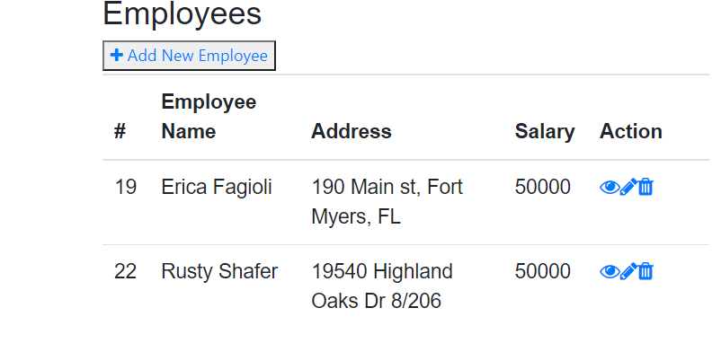
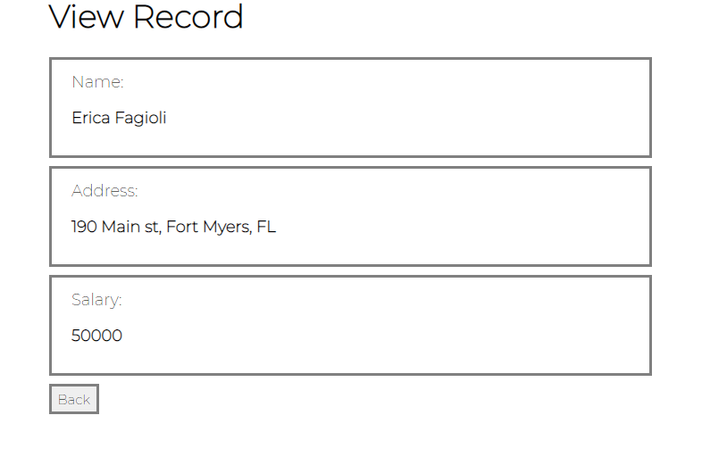
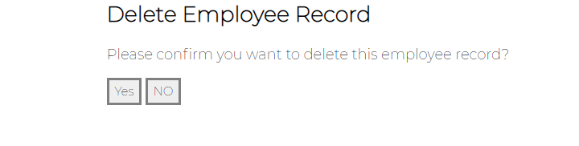

# PHO CRUD APP FOR EMPLOYEE DATA

## Authors

Erica Fagioli

## Table of Contents

-   [Description / Objective](#description--objective)
-   [Links](#links)
-   [Screen Capture](#screen-capture)
-   [Tools](#tools)
-   [Use](#use)
-   [License](#license)

## Description

I created a simple PHP application for an employee data table using CRUD operation on a MYSQL database. I used CRUD to create employee data, read employee  data, update employee data, and delete the employee data.


## Links

### Github Repository

[PHP Github Repository](https://github.com/efagioli01/EMPLOYEE-DATA-PHP-CRUD)


## Screen Capture

This screen capture depicts the information from the database 






## Tools

 HTML, CSS, PHP, MySQL, Git

## Use

```
To use this application, : Clone from git
```
```
Import database to PHPMYADMIN (SQL DB)

CREATE TABLE employees (
    id INT NOT NULL PRIMARY KEY AUTO_INCREMENT,
    name VARCHAR(100) NOT NULL,
    address VARCHAR(255) NOT NULL,
    salary INT(10) NOT NULL
);
```
```
Import database.sql file
```

```
Access with http://localhost/PHP%20Employees/
```


## Future Considerations

A feature that I would need to update is the tooltip which is the only part of the 
app I used bootstrap for. I would like to implement another way of
acheiving the same outcome without using a tool tip and relying on 
Bootstrap fot it.


## License

[](https://opensource.org/licenses/MIT)

Copyright 2021 Erica Fagioli

Permission is hereby granted, free of charge, to any person obtaining a copy of this software and associated documentation files (the "Software"), to deal in the Software without restriction, including without limitation the rights to use, copy, modify, merge, publish, distribute, sublicense, and/or sell copies of the Software, and to permit persons to whom the Software is furnished to do so, subject to the following conditions:

The above copyright notice and this permission notice shall be included in all copies or substantial portions of the Software.

THE SOFTWARE IS PROVIDED "AS IS", WITHOUT WARRANTY OF ANY KIND, EXPRESS OR IMPLIED, INCLUDING BUT NOT LIMITED TO THE WARRANTIES OF MERCHANTABILITY, FITNESS FOR A PARTICULAR PURPOSE AND NONINFRINGEMENT. IN NO EVENT SHALL THE AUTHORS OR COPYRIGHT HOLDERS BE LIABLE FOR ANY CLAIM, DAMAGES OR OTHER LIABILITY, WHETHER IN AN ACTION OF CONTRACT, TORT OR OTHERWISE, ARISING FROM, OUT OF OR IN CONNECTION WITH THE SOFTWARE OR THE USE OR OTHER DEALINGS IN THE SOFTWARE.
